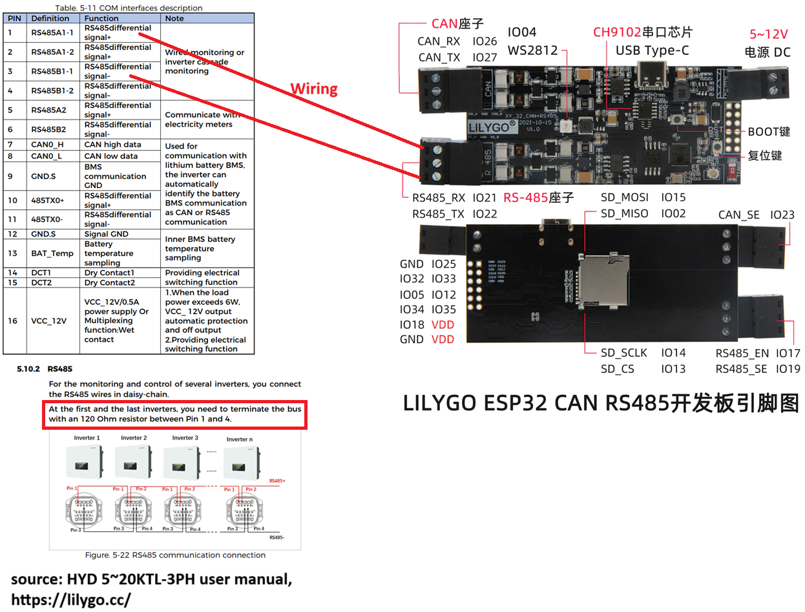
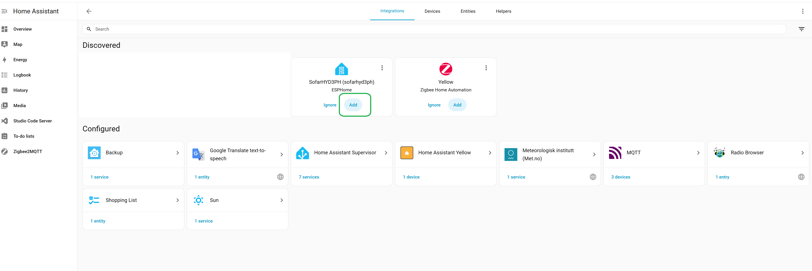
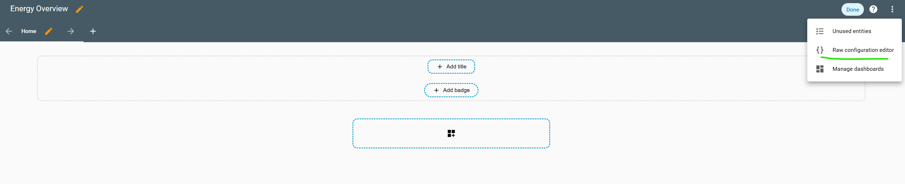
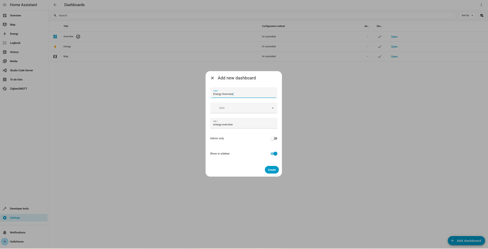
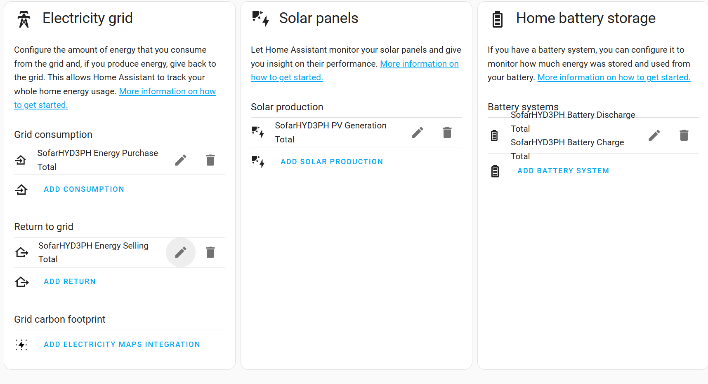
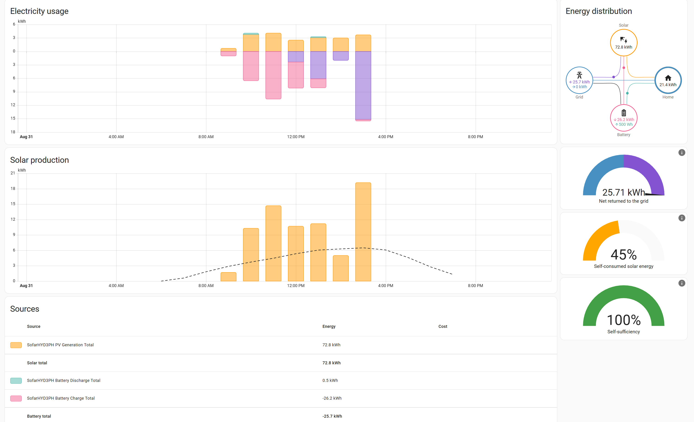
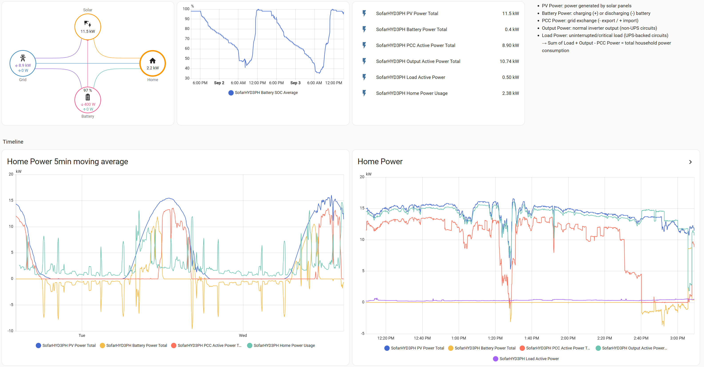

# SofarHYD3PH

Home Assistant integration of Sofar HYD 3‑phase inverters via RS‑485 Modbus using ESPHome. This project exposes key realtime power metrics, battery state, and daily/total energy counters with correct scaling and metadata for seamless use in Home Assistant dashboards and the Energy panel.

- Hardware target: LILYGO ESP32 CAN RS485 board (built‑in RS‑485 transceiver and boost supply)
- Protocol: Modbus RTU over UART1 (9600 8N1, default slave address 1)
- Ready for: Power Flow dashboards and Energy Dashboard


## Contents

- `sofarhyd3ph.yaml` – ESPHome device configuration exposing inverter sensors over Modbus
- `homeassistantenergyoverview.yaml` – Example Lovelace view using power‑flow‑card‑plus and graphs
- `guide/` – Setup and Energy dashboard screenshots
  - `guide/pysicalsetup.png` – Physical wiring reference (ESP32 RS‑485 to inverter)
  - `guide/adddevice.png` – ESPHome add device flow
  - `guide/Rawconfig.png` – Paste YAML via Raw configuration editor
  - `guide/createdashboard.png` – Example Lovelace dashboard created
  - `guide/energypanelsetup.png` – Energy panel configuration in Home Assistant
  - `guide/energypanelview.png` – Example Energy panel view (after sensors added)
  - `guide/energyoverview.png` – At‑a‑glance Energy overview example
- `LICENSE`

## Features

- Realtime power:
  - PV Power (kW)
  - Battery Power (kW, positive = charging, negative = discharging)
  - Grid/PCC Power (kW, positive = import, negative = export)
  - Output Active Power and Load Active Power (kW)
  - Grid and Output Frequencies (Hz)
- Energy totals compatible with HA Energy Dashboard:
  - PV generation today/total (kWh)
  - Load consumption today/total (kWh)
  - Energy purchased/sold today/total (kWh)
  - Battery charge/discharge today/total (kWh)
- Correct device_class/state_class on sensors (e.g., energy total_increasing)
- Example Lovelace view (power flow + graphs)
- Works out‑of‑the‑box on LILYGO ESP32 CAN RS485

## Quick Start

1) Hardware wiring (LILYGO ESP32 CAN RS485)
- RS‑485 A(-)/B(+) from the ESP board to the inverter&#39;s RS‑485 terminals (match A↔A, B↔B per inverter manual).
- Optional: Ensure proper line termination (120 Ω) at the ends of the RS‑485 bus if required by your layout.
- This config keeps the board&#39;s RS‑485 transceiver and boost supply enabled:
  - Boost enable: GPIO16
  - RE (receive enable): GPIO17
  - Shutdown disable: GPIO19
  - UART1 TX/RX: TX=22, RX=21

Reference wiring:


2) Flash with ESPHome
- Open ESPHome (Add‑on or local) and add a new device called "SofarHYD3PH".
- Copy the content of `sofarhyd3ph.yaml` into the new device.
- Provide your secrets in `secrets.yaml`:

```yaml
wifi_ssid: "YOUR_WIFI_SSID"
wifi_password: "YOUR_WIFI_PASSWORD"
SofarHYD3PHAPIKey: "generate-a-strong-api-key"
SofarHYD3PHOTA: "generate-a-strong-ota-password"
```

- Install over USB the first time, then use OTA.

3) Pair with Home Assistant
- After the device boots and joins Wi‑Fi, Home Assistant will discover it (ESPHome).
- Accept the device and entities.

4) Import the example dashboard (optional but recommended)
- Install the custom card "Power Flow Card Plus" via HACS:
  - HACS → Frontend → Search "power-flow-card-plus" → Install → Reload resources.
- Create a new dashboard/view and paste the YAML from `homeassistantenergyoverview.yaml` into a Raw configuration editor for that view.
- Example steps:
  - Add device in ESPHome:  
    
  - Paste dashboard YAML via Raw config:  
    
  - Resulting example dashboard:  
    

## Energy Dashboard setup (Home Assistant)

To populate the Energy panel with correct totals, add the “Total” energy sensors (state_class: total_increasing) from this project.

1) Open Settings → Dashboards → Energy.  
2) Add the following as applicable:
- Solar production: PV Generation Total
- Home consumption: Load Consumption Total
- Grid consumption (from grid): Energy Purchase Total
- Return to grid (to grid): Energy Selling Total
- Battery charge: Battery Charge Total
- Battery discharge: Battery Discharge Total



After saving, the Energy view will start aggregating and display charts over time:


For a quick at‑a‑glance card, you can also build an Energy overview with the example dashboard:


## Entities exposed

From `sofarhyd3ph.yaml`:

Realtime power and frequency (state_class: measurement)
- PV Power Total (`sensor.sofarhyd3ph_pv_power_total`, kW, 0.1 resolution)
- Battery Power Total (`sensor.sofarhyd3ph_battery_power_total`, kW, 0.1 resolution)
- PCC Active Power Total (`sensor.sofarhyd3ph_pcc_active_power_total`, kW, 0.01 resolution)
- Output Active Power Total (`sensor.sofarhyd3ph_output_active_power_total`, kW, 0.01 resolution)
- Load Active Power (`sensor.sofarhyd3ph_load_active_power`, kW, 0.01 resolution)
- Grid Frequency (`sensor.sofarhyd3ph_grid_frequency`, Hz)
- Output Frequency (`sensor.sofarhyd3ph_output_frequency`, Hz)
- Battery SOC Average (`sensor.sofarhyd3ph_battery_soc_average`, %)
- Battery SOH (`sensor.sofarhyd3ph_battery_soh`, %)

Energy totals (device_class: energy, state_class: total_increasing)
- PV Generation Today / Total (kWh)
- Load Consumption Today / Total (kWh)
- Energy Purchase Today / Total (kWh)
- Energy Selling Today / Total (kWh)
- Battery Charge Today / Total (kWh)
- Battery Discharge Today / Total (kWh)

Note: The YAML config uses proper scaling factors (0.01 or 0.1 as appropriate) and sets accurate device_class/state_class to make these entities drop‑in for the Energy Dashboard.

## Sign conventions

- Battery Power: positive = charging, negative = discharging. In the example dashboard, `invert_state: true` is used as needed by the card to render flow direction intuitively.
- Grid (PCC) Power: positive = import, negative = export. The dashboard uses `invert_state: true` to match card conventions.

## Modbus details

- UART1: TX=22, RX=21, 9600 baud, parity NONE, 1 stop bit (8N1)
- Inverter slave address: default `0x01` (set `address` under `modbus_controller` to match your inverter)
- Update interval: 10s (tune as desired)
- Command throttle: 200 ms

## Example Lovelace view

The provided `homeassistantenergyoverview.yaml` includes:
- `power-flow-card-plus` (requires HACS installation)
- 5‑minute moving average statistics graph
- History graphs for PV, Battery, Grid, Output, and Load power
- A quick legend/description block

Paste the YAML into a view&#39;s Raw editor or use it as a reference to build your own.

## Captive portal fallback

If Wi‑Fi fails, the device opens an AP:
- SSID: `Sofarrs485Sec2 Fallback Hotspot`
- Password: `CmFNykHyE6D5`
You can change these in `wifi: ap:` in `sofarhyd3ph.yaml`.

## Folder structure

```
.
├─ sofarhyd3ph.yaml
├─ homeassistantenergyoverview.yaml
├─ guide/
│  ├─ pysicalsetup.png
│  ├─ adddevice.png
│  ├─ Rawconfig.png
│  ├─ createdashboard.png
│  ├─ energypanelsetup.png
│  ├─ energypanelview.png
│  └─ energyoverview.png
├─ LICENSE
└─ README.md
```

## Troubleshooting

- No data / timeouts:
  - Check RS‑485 A/B wiring and polarity.
  - Verify inverter Modbus address (default 1) and speed (9600 8N1).
  - Ensure bus termination as per wiring length/topology.
- Wrong sign on flows:
  - Review the "Sign conventions" above and adjust `invert_state` options in the dashboard as preferred.
- Energy Dashboard:
  - Use the "Total" energy sensors (`..._total`) when adding to the Energy panel.
  - Ensure state_class is `total_increasing` (already set in the YAML).

## License

This project is licensed under the terms of the LICENSE file in this repository.

## Credits

- Built with ESPHome and Home Assistant.
- Tested with LILYGO ESP32 CAN RS485 board.
